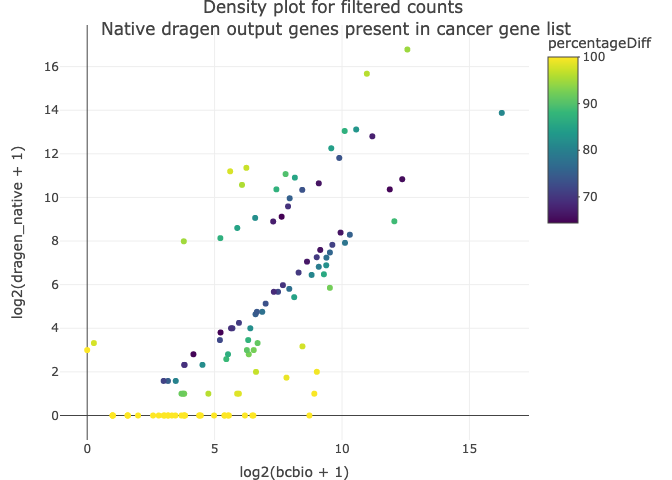

## Background

Since 2018 UMCCR has been using the [bcbio](https://github.com/bcbio/bcbio-nextgen) framework to analyze clinical sequencing data. Our [whole-genome analysis](https://github.com/umccr/workflows/blob/master/configurations/std_workflow_cancer_hg38.yaml) includes the preparation of sequencing reads, alignment to the `hg38` reference genome, ensemble-based variant calling for both germline and somatic changes, somatic structural variant calling and the generation of quality control metrics. These steps generate the primary (read-level) and secondary (variant-level) results of our workflow.

The generated results serve as input for our post-processing framework [`umccrise`](https://github.com/umccr/umccrise) which provides additional analytical steps (e.g., viral integration, somatic signatures, copy number variant calling) and generates data summaries for UMCCR's curation team -- the 'tertiary' results.

For [RNA sequence analysis](https://github.com/umccr/workflows/blob/master/configurations/std_workflow_wts_hg38.yaml) with bcbio we create both 'standard' alignments with [STAR](https://github.com/alexdobin/STAR) for visualisation and fusion detection with [Arriba](https://github.com/suhrig/arriba) alongside 'pseudo' alignments with [kallisto](https://github.com/pachterlab/kallisto) for transcript counts. These primary and secondary results are processed with [RNASum](https://github.com/umccr/RNAsum) to compare and contrast expression values with a reference cohort, link RNA and WGS information, and to summarise results.

Since the beginning of 2022 we have been testing an alternative approach to generate the primary and secondary data based on Illumina's [DRAGEN](https://www.illumina.com/products/by-type/informatics-products/dragen-bio-it-platform.html) platform deployed on Illumina's Connected Analytics (ICA V1) environment. This document describes key changes in the workflows, their environments and the impact on reference and validation samples.

### Change Summary

The migration from bcbio to DRAGEN includes a number of key changes to our whole genome analysis:

* **Alignment:** We rely on DRAGEN read alignments instead of those generated by [bwa-mem](https://github.com/lh3/bwa). The changes between the two aligners have been [described by the GATK team](https://gatk.broadinstitute.org/hc/en-us/articles/4410953761563) at The Broad Institute who are migrating their best practice (germline) workflow to DRAGEN. DRAGEN's aligner handles ALT regions differently - it is ['ALT aware'](https://support.illumina.com/content/dam/illumina-support/help/Illumina_DRAGEN_Bio_IT_Platform_v3_7_1000000141465/Content/SW/Informatics/Dragen/GPipelineAltMap_fDG.htm) and retains links between reads on the primary assembly vs. ALT regions which helps avoid false negative variant calls in these regions.
* **Read trimming:** We no longer trim Poly-X nucleotides from the end of reads, a step performed with [atropos](https://github.com/jdidion/atropos) in bcbio. This is a regression but based on our initial benchmark data the impact seems to be minimal. Poly-G sections _are_ [soft-trimmed by default](https://support-docs.illumina.com/SW/DRAGEN_v39/Content/SW/DRAGEN/ReadTrimming.htm?Highlight=trimming) which covers the most common Poly-X trimming usecase.
* **Reference genome masking:** For bcbio we limited variant calls to no-ALT regions of the reference genome; additionally, a number of difficult-to-call genomic regions were masked to prevent variant callers from taking too long. This is no longer necessary with DRAGEN, and while this results in increased false positives, we reduce the risk of missing important genomic changes.
* **Germline small variant detection:** Germline SNV calls are now performed by DRAGEN's single caller instead of using a 2-out-of-3 ensemble approach (GATK Haplotype Caller, VarDict, Strelka2). This follows GATK's best practice. While the ensemble approach worked well by pairing two sensitive callers with one strict caller, we continued to see problems with complex variants getting filtered out due to slightly different variant representations. The Broad Institute has demonstrated [functional equivalence](https://gatk.broadinstitute.org/hc/en-us/articles/4410456501915-Functional-equivalence-in-DRAGEN-GATK) between DRAGEN germline variant calls and GATK best practice variant calls.
* **Somatic small variant detection:** Somatic SNV calls follow the same approach, switching from a 2-out-of-3 ensemble approach (Mutect2, Vardict, Strelka2) to DRAGEN somatic variant calls. DRAGEN's variant caller is based on Strelka2 and performs better than our old ensemble approach in a comparison of [SEQC-II benchmark data](https://github.com/umccr-illumina/dragen/blob/master/notes/2020-01-09_Dragen_Update.md), while avoiding the variant representation issue outlined above.
* **Somatic structural variant detection:** Structural variant calls now use DRAGEN's SV caller instead of [Manta](https://github.com/Illumina/manta). Manta's open source development stopped in 2019 with version 1.6 and was continued as a closed-source project within DRAGEN. Based on our communication with Illumina DRAGEN's SV caller would be equivalent to Manta 1.9 if public development had continued. We benefit from [higher sensitivity](https://github.com/umccr-illumina/dragen/blob/master/notes/manta_history.md), more stringent filtering, and a better integration of the somatic SNV and SV callers.

For the RNA sequence analysis the changes include:

* **Alignment:** We rely on DRAGEN read alignments for WTS, instead of those generated by [STAR - Spliced Transcripts Alignment to a Reference](https://github.com/alexdobin/STAR) for bcbio. The DRAGEN RNA pipeline uses the DRAGEN RNA-Seq spliced aligner. Mapping of short seed sequences from RNA-Seq reads is performed similarly to mapping DNA reads. In addition, splice junctions (the joining of noncontiguous exons in RNA transcripts) near the mapped seeds are detected and incorporated into the full read alignments.
* **Read counts:** We rely on the DRAGEN gene expression quantification module which estimates the expression of each transcript and gene in an RNA-seq dataset, instead of [kallisto](https://github.com/pachterlab/kallisto). Internally, it uses [salmon](https://github.com/COMBINE-lab/salmon), which is a tool to quantify the expression of transcripts using RNA-seq data. Both are pseudo-count approaches and in principle [work similarly](http://crazyhottommy.blogspot.com/2016/07/comparing-salmon-kalliso-and-star-htseq.html) and exhibit high correlation in the results.
* **Fusion calling:** We are using [Arriba](https://github.com/suhrig/arriba) for fusion calling and drawings. In the new workflow we use the DRAGEN-aligned reads instead of the STAR alignments as input to Arriba.

### Comparison of benchmark data

All comparisons are based on bcbio 1.1.6a with umccrise 1.2.4 compared to DRAGEN 3.9 bcbio configurations are captured in our [configurations](https://github.com/umccr/workflows/tree/master/configurations) repository. DRAGEN workflows include:

| Workflow name                 | Version ID                                                 | Workflow Link                                                                                                                                                                    | Catalogue Link                                                                                                                                                                                          |
|-------------------------------|------------------------------------------------------------|----------------------------------------------------------------------------------------------------------------------------------------------------------------------------------|---------------------------------------------------------------------------------------------------------------------------------------------------------------------------------------------------------|
| Dragen Somatic Workflow       | wfl.aa0ccece4e004839aa7374d1d6530633/3.9.3--7ba55e9        | [workflow](https://github.com/umccr/cwl-ica/blob/7ba55e9/workflows/dragen-somatic-pipeline/3.9.3/dragen-somatic-pipeline__3.9.3.cwl)                                             | [catalogue](https://github.com/umccr/cwl-ica/blob/baa5a66/.github/catalogue/docs/workflows/dragen-somatic-pipeline/3.9.3/dragen-somatic-pipeline__3.9.3.md)                                             |
| umccrise (plus germline)      | wfl.7ed9c6014ac9498fbcbd4c17c28bc0d4/2.0.2--3.9.3--0a80def | [workflow](https://github.com/umccr/cwl-ica/blob/0a80def/workflows/umccrise-with-dragen-germline-pipeline/2.0.2--3.9.3/umccrise-with-dragen-germline-pipeline__2.0.2--3.9.3.cwl) | [catalogue](https://github.com/umccr/cwl-ica/blob/5278c1d/.github/catalogue/docs/workflows/umccrise-with-dragen-germline-pipeline/2.0.2--3.9.3/umccrise-with-dragen-germline-pipeline__2.0.2--3.9.3.md) |
| Dragen Transcriptome Workflow | wfl.7e5ba7470b5549a6b4bf6d95daaa1214/3.9.3--e24feb2        | [workflow](https://github.com/umccr/cwl-ica/blob/e24feb2/workflows/dragen-transcriptome-pipeline/3.9.3/dragen-transcriptome-pipeline__3.9.3.cwl)                                 | [catalogue](https://github.com/umccr/cwl-ica/blob/297497c/.github/catalogue/docs/workflows/dragen-transcriptome-pipeline/3.9.3/dragen-transcriptome-pipeline__3.9.3.md)                                 |

#### Germline benchmark comparison

Germline comparisons are based on four replicates of NA12878 sequenced on an Illumina NovaSeq at the Melbourne Clinical Genomics Platform. Germline variant calls were compared between bcbio and DRAGEN production workflows using [vcf_eval](https://github.com/umccr/biodaily/tree/vcf_eval/vcf_eval) and are based on the [Genome in a Bottle V4.2.1 benchmark set](https://ftp-trace.ncbi.nlm.nih.gov/ReferenceSamples/giab/release/) and high confidence regions (`HG001_GRCh38_1_22_v4.2.1_benchmark.bed`).

_Sample information in the LIMS:_

| IlluminaID                    | SubjectID | SampleID | LibraryID | ExternalSubjectID | ExternalSampleID |
|-------------------------------|-----------|----------|-----------|-------------------|------------------|
| 170802_A00130_0016_AH2JGGDMXX | SBJ00027  | -        | -         | NA12878           | NA12878-1VD      |
| 170802_A00130_0016_AH2JGGDMXX | SBJ00027  | -        | -         | NA12878           | NA12878-2VD      |
| 170823_A00130_0019_AH2N2FDMXX | SBJ00027  | -        | -         | NA12878           | NA12878-3VD_S1   |
| 170829_A00130_0020_AH2MKTDMXX | SBJ00027  | -        | -         | NA12878           | NA12878-4KC_S7   |


_SNVs:_

| sample      | workflow | Truth     | TP        | FP     | FN     | Recall | Precision | f1    |
|-------------|----------|-----------|-----------|--------|--------|--------|-----------|-------|
| NA12878-1VD | bcbio    | 3,253,394 | 3,236,126 | 11,868 | 17,268 |  0.995 |     0.996 | 0.996 |
| NA12878-1VD | DRAGEN   | 3,253,394 | 3,241,892 |  7,177 | 11,502 |  0.996 |     0.998 | 0.997 |
| NA12878-2VD | bcbio    | 3,253,394 | 3,236,106 | 11,752 | 17,288 |  0.995 |     0.996 | 0.996 |
| NA12878-2VD | DRAGEN   | 3,253,394 | 3,241,517 |  6,479 | 11,877 |  0.996 |     0.998 | 0.997 |
| NA12878-3VD | bcbio    | 3,253,394 | 3,236,886 | 11,724 | 16,508 |  0.995 |     0.996 | 0.996 |
| NA12878-3VD | DRAGEN   | 3,253,394 | 3,241,927 |  6,236 | 11,467 |  0.996 |     0.998 | 0.997 |
| NA12878-4KC | bcbio    | 3,253,394 | 3,235,975 | 12,119 | 17,419 |  0.995 |     0.996 | 0.995 |
| NA12878-4KC | DRAGEN   | 3,253,394 | 3,242,203 |  7,523 | 11,191 |  0.997 |     0.998 | 0.997 |


_InDels:_

| sample      | workflow | Truth   | TP      | FP     | FN     | Recall | Precision | f1    |
|-------------|----------|---------|---------|--------|--------|--------|-----------|-------|
| NA12878-1VD | bcbio    | 468,694 | 425,709 | 65,446 | 42,985 |  0.908 |     0.867 | 0.887 |
| NA12878-1VD | DRAGEN   | 468,694 | 465,285 |  4,470 |  3,409 |  0.993 |     0.990 | 0.992 |
| NA12878-2VD | bcbio    | 468,694 | 426,549 | 65,248 | 42,145 |  0.910 |     0.867 | 0.888 |
| NA12878-2VD | DRAGEN   | 468,694 | 465,648 |  3,813 |  3,046 |  0.994 |     0.992 | 0.993 |
| NA12878-3VD | bcbio    | 468,694 | 427,611 | 67,827 | 41,083 |  0.912 |     0.863 | 0.887 |
| NA12878-3VD | DRAGEN   | 468,694 | 466,069 |  3,211 |  2,625 |  0.994 |     0.993 | 0.994 |
| NA12878-4KC | bcbio    | 468,694 | 423,757 | 66,845 | 44,937 |  0.904 |     0.864 | 0.883 |
| NA12878-4KC | DRAGEN   | 468,694 | 465,071 |  4,758 |  3,623 |  0.992 |     0.990 | 0.991 |

The DRAGEN germline SNV calls match bcbio ensemble calls and are significantly better when it comes to calling insertions or deletions, a reflection of the ensemble representation issues outlined above.


#### Somatic benchmark comparison

Somatic SNV comparisons between DRAGEN and bcbio ensemble calls are evaluated against the [SEQC-II test data](https://www.biorxiv.org/content/10.1101/625624v1) (SRA ID `SRP162370`, benchmark sets available via [FTP](ftp://ftp-trace.ncbi.nlm.nih.gov/seqc/ftp/Somatic_Mutation_WG/)). A dilution series of DNA from the SEQC-II triple-negative breast cancer (TNBC) cell line (HCC1395) and a B lymphocyte-derived normal cell line (HCC1395BL) was sequenced on an Illumina NovaSeq at the Melbourne Clinical Genomics Platform and again compared with `vcf_eval`. From the in-silico tests we noticed no differences in overall performance between 100% sample down to 50%; accordingly the dilution series sequencing was limited to the 10-40% range as we expect any problems to show up in this range.

**Sample information in the LIMS:**

| IlluminaID                    | SubjectID | SampleID       | LibraryID      | ExternalSubjectID | ExternalSampleID         |
|-------------------------------|-----------|----------------|----------------|-------------------|--------------------------|
| 210223_A01052_0033_AHVHWGDMXX | SBJ00480  | PTC_HCC1395_40 | L2000432_rerun | HCC1395           | Mix-cell-line-HCC1395-40 |
| 210223_A01052_0033_AHVHWGDMXX | SBJ00480  | PTC_HCC1395_30 | L2000433_rerun | HCC1395           | Mix-cell-line-HCC1395-30 |
| 210223_A01052_0033_AHVHWGDMXX | SBJ00480  | PTC_HCC1395_20 | L2000434_rerun | HCC1395           | Mix-cell-line-HCC1395-20 |
| 210223_A01052_0033_AHVHWGDMXX | SBJ00480  | PTC_HCC1395_10 | L2000435_rerun | HCC1395           | Mix-cell-line-HCC1395-10 |
| 210331_A01052_0041_BHYMHFDSXY | SBJ00480  | PTC_TsqN200511 | L2000437_rerun | HCC1395           | HCC1395BL-01             |


**SNVs:**

| sample                                 | workflow  | Truth | TP    | FP   | FN    | Recall | Precision | f1    |
|----------------------------------------|--------|-------|-------|------|-------|--------|-----------|-------|
| SBJ00480-Mix-cell-line-HCC1395-40      | bcbio  | 39447 | 31116 | 3529 |  8331 |  0.789 |     0.898 | 0.840 |
| SBJ00480-Mix-cell-line-HCC1395-40_PASS | DRAGEN | 39447 | 31179 | 1080 |  8268 |  0.790 |     0.967 | 0.870 |
| SBJ00480-Mix-cell-line-HCC1395-30      | bcbio  | 39447 | 30227 | 4228 |  9220 |  0.766 |     0.877 | 0.818 |
| SBJ00480-Mix-cell-line-HCC1395-30_PASS | DRAGEN | 39447 | 29750 |  991 |  9697 |  0.754 |     0.968 | 0.848 |
| SBJ00480-Mix-cell-line-HCC1395-20      | bcbio  | 39447 | 27345 | 3559 | 12102 |  0.693 |     0.885 | 0.777 |
| SBJ00480-Mix-cell-line-HCC1395-20_PASS | DRAGEN | 39447 | 26286 |  677 | 13161 |  0.666 |     0.975 | 0.792 |
| SBJ00480-Mix-cell-line-HCC1395-10      | bcbio  | 39447 | 15393 | 3543 | 24054 |  0.390 |     0.813 | 0.527 |
| SBJ00480-Mix-cell-line-HCC1395-10_PASS | DRAGEN | 39447 | 26286 |  677 | 13161 |  0.666 |     0.975 | 0.792 |

We see a slight loss of sensitivity for DRAGEN with a large improvement in precision, a trade-off we found to be acceptable particularly since we rescue potentially missed variants in cancer hotspots at a later stage in `umccrise`. The difference at 10% cellularity is expected as bcbio filters out variants with an allelic frequency <10% in our setting.

**InDels:**

| sample                                 | workflow  | Truth | TP   | FP   | FN   | Recall | Precision | f1    |
|----------------------------------------|--------|-------|------|------|------|--------|-----------|-------|
| SBJ00480-Mix-cell-line-HCC1395-40      | bcbio  |  1625 | 1169 | 1609 |  456 |  0.719 |     0.421 | 0.531 |
| SBJ00480-Mix-cell-line-HCC1395-40_PASS | DRAGEN |  1625 | 1193 |  591 |  432 |  0.734 |     0.669 | 0.700 |
| SBJ00480-Mix-cell-line-HCC1395-30      | bcbio  |  1625 | 1120 | 1539 |  505 |  0.689 |     0.421 | 0.523 |
| SBJ00480-Mix-cell-line-HCC1395-30_PASS | DRAGEN |  1625 | 1106 |  522 |  519 |  0.681 |     0.679 | 0.680 |
| SBJ00480-Mix-cell-line-HCC1395-20      | bcbio  |  1625 |  998 | 1410 |  627 |  0.614 |     0.414 | 0.495 |
| SBJ00480-Mix-cell-line-HCC1395-20_PASS | DRAGEN |  1625 |  933 |  360 |  692 |  0.574 |     0.722 | 0.639 |
| SBJ00480-Mix-cell-line-HCC1395-10      | bcbio  |  1625 |  503 | 1196 | 1122 |  0.310 |     0.296 | 0.303 |
| SBJ00480-Mix-cell-line-HCC1395-10_PASS | DRAGEN |  1625 |  933 |  360 |  692 |  0.574 |     0.722 | 0.639 |

As with the germline variant calls we see a marked improvement in both sensitivity and specificity for DRAGEN calls over the existing bcbio ensemble calls.

### Comparison of validation samples

We routinely assess the impact of any major workflow change on the primary/secondary data as well as the generated HTML reports for a number of manually selected validation samples. Samples where chosen to reflect our usual clinical sample quality, diversity of ethnicity, gender and interesting events:

| Sample Name           | SubjectID | Sample Notes | bcbio URL | DRAGEN URL |
|-----------------------|-----------|--------------|-----------|----|
| 2016.249.17.MH.P033   | SBJ00471       | BRCA signature, BRCA2 SV      | [bcbio](https://github.com/umccr/workflows/tree/master/change_documents/2022-06-08_bcbio-to-DRAGEN/umccrise_reports/bcbio/2016.249.17.MH.P033) | [DRAGEN](https://github.com/umccr/workflows/tree/master/change_documents/2022-06-08_bcbio-to-DRAGEN/umccrise_reports/dragen/2016.249.17.MH.P033) |
| 2016.249.18.WH.P025   | SBJ00031       | Poor quality, SV40 integration, BRCA2 germline | [bcbio](https://github.com/umccr/workflows/tree/master/change_documents/2022-06-08_bcbio-to-DRAGEN/umccrise_reports/bcbio/2016.249.18.WH.P025) | [DRAGEN](https://github.com/umccr/workflows/tree/master/change_documents/2022-06-08_bcbio-to-DRAGEN/umccrise_reports/dragen/2016.249.18.WH.P025) |
| CUP-Pairs8            | n/a       | FFPE       | [bcbio](https://github.com/umccr/workflows/tree/master/change_documents/2022-06-08_bcbio-to-DRAGEN/umccrise_reports/bcbio/CUP-Pairs8) | [DRAGEN](https://github.com/umccr/workflows/tree/master/change_documents/2022-06-08_bcbio-to-DRAGEN/umccrise_reports/dragen/CUP-Pairs8) |
| SFRC01073             | SBJ00204 | BRCA signature          | [bcbio](https://github.com/umccr/workflows/tree/master/change_documents/2022-06-08_bcbio-to-DRAGEN/umccrise_reports/bcbio/SFRC01073) | [DRAGEN](https://github.com/umccr/workflows/tree/master/change_documents/2022-06-08_bcbio-to-DRAGEN/umccrise_reports/dragen/SFRC01073) |
| B_ALL_Case_10         | SBJ00040 | Blood cancer          | [bcbio](https://github.com/umccr/workflows/tree/master/change_documents/2022-06-08_bcbio-to-DRAGEN/umccrise_reports/bcbio/B_ALL_Case_10) | [DRAGEN](https://github.com/umccr/workflows/tree/master/change_documents/2022-06-08_bcbio-to-DRAGEN/umccrise_reports/dragen/B_ALL_Case_10) |
| SEQC_SEQC50           | SBJ00481 | Reference sample          | [bcbio](https://github.com/umccr/workflows/tree/master/change_documents/2022-06-08_bcbio-to-DRAGEN/umccrise_reports/bcbio/SEQC50) | [DRAGEN](https://github.com/umccr/workflows/tree/master/change_documents/2022-06-08_bcbio-to-DRAGEN/umccrise_reports/dragen/SEQC50) |
| DiploidNeverResponder | n/a       | HPV integration          | [bcbio](https://github.com/umccr/workflows/tree/master/change_documents/2022-06-08_bcbio-to-DRAGEN/umccrise_reports/bcbio/DiploidNeverResponder) | [DRAGEN](https://github.com/umccr/workflows/tree/master/change_documents/2022-06-08_bcbio-to-DRAGEN/umccrise_reports/dragen/DiploidNeverResponder) |
| SBJ00303              | SBJ00303  | ATRX frameshift          | [bcbio](https://github.com/umccr/workflows/tree/master/change_documents/2022-06-08_bcbio-to-DRAGEN/umccrise_reports/bcbio/SBJ00303)| [DRAGEN](https://github.com/umccr/workflows/tree/master/change_documents/2022-06-08_bcbio-to-DRAGEN/umccrise_reports/dragen/SBJ00303) |

#### Data comparison

Globally, we compare workflow results with [woof](https://github.com/umccr/woof) to generate a [comparison report](https://github.com/umccr/workflows/blob/master/change_documents/2022-06-08_bcbio-to-DRAGEN/woof_report/reports/umccrise_report.html). This comparison isn't ideal for the bcbio-to-DRAGEN migration as it sets the bcbio results as 'true positive' but it does allow us to identify changes more quickly:

* key features -- particularly those highlighted in the sample notes -- are conserved for all samples in the DRAGEN results.
* there is no change in Tier 1 or Tier 2 variants
* structural variants differ moslty in the FFPE sample due to different filtering strategies


#### Report comparison

Please see the [February 2022 comparison page](https://github.com/umccr/workflows/tree/master/umccrise/comparisons#2022-feb) for sample specific details or below for a high-level summary of consistently observed differences and commentary for some outliers.

_MultiQC:_ The MultiQC report layout and tables have changed slightly as our main source of information now comes from the DRAGEN QC metrics. Slight differences in mapping statistics are expected as we now align against ALT regions and no longer mask parts of the reference genome. We also see an overall lower SNV filtering rate; DRAGEN's variant caller is slightly less noisy for most samples (but see below for an exception).

In addition, MultiQC will report fewer (or no) homozyguous somatic mutations. DRAGEN does not use the VCF's `GT` field to report zygosity which follows the old MuTect2 model - se the [Github discussion](https://github.com/umccr-illumina/dragen/issues/37#issuecomment-1122231632). This has no impact on the variants called.

_Coverage:_ Coverage of germline and tumor samples is all but identical. Previously difficult to map regions like HLA now have improved coverage.

_CPSR:_ Identical across all samples with a slight increase of reported VUS from InDels. DRAGEN's false negative-rate for InDels is lower so this is expected.

_PCGR:_ Any changes between PCGR reports are limited to Tier 4 events with a individual tier 3 events changing for low allelic frequency calls (i.e., those around 10% AF). The SEQC-II reference sample exhibits a shift in MSI status, likely due to the shift in InDel to SNV calls; this change is limited to PCGR and the Cancer Reporter still has both versions listed as 'stable' due to a higher threshold.

The one exception to this is `2016.249.18.WH.P025`. DRAGEN reports a significant number of likely false positive, low allelic frequency mutations that do not have an impact on Tier 1/2 variants but do shift the TMB from 9 to 21. These variants were filtered in DRAGEN 3.6 due to being phased and clustered, but a [change in Illumina's approach to variant filtering](https://github.com/umccr-illumina/dragen/issues/35#issuecomment-1078567272) means they are now included. Illumina feel that the previous filtering apporoach resulted in a reduced sensitivity. This makes sense, but we are exploring options of annotating these clustered variants and flagging samples with a higher than expected number of clustered variants to indicate that TMB might be inflated.

_Cancer Reporter:_ Overall, the biggest change across all samples is the reduced noise in SV calls and a reduction of somatic copy number segments, also likely due to reduced noise in the SV calls which seed copy number boundaries. Calls remain stable for SVs with more than 5-10 reads in support with some exceptions - please see the [comparison page](https://github.com/umccr/workflows/tree/master/umccrise/comparisons#2022-feb) for details; in brief:

* A PUM2-CASC8 fusion in the NeverResponder disappeared through multiple Dup/Del events involving these genes
* A CREB1 fusion in SFRC01073 was filtered out due to the DRAGEN alignment shifting the split-read vs paired-read support over the fitering threshold; this approach is scheduled for a review

Somatic signatures scores also differ slightly between reports due to the different variant calling approach, but overall ranking is maintained for all samples except for lower tier signatures with overall poor support.


### RNA comparison

The DRAGEN WTS processing methods are similar to the approach we have taken with bcbio but the change still has an impact on primary/secondary results. DRAGEN MultiQC reports now also include a set of reference samples, similar to the WGS MultiQC reports, alongside more in-depth metrics.

_Global comparison:_

Count data shows good correlation overall and improves between a transcript-based comparison (Spearman correlation = 0.76) to a gene-based comparison (Spearman correlation = 0.8). The impact of these changes for the RNAsum reference cohort comparison is expected to be minimal. 


However, we did not notice difference in expression for few of [cancer genes](https://github.com/umccr/workflows/blob/master/configurations/resources/hg38/umccr_cancer_genes.latest.tsv) between bcbio Kallisto and Dragen Salmon expression when converted to gene level counts. 



Focusing at the outliers, `GATA3 ENSG00000107485` is the only exception that has higher expression value in bcbio derived gene level estimation that is absent in Dragen derived expression results. The coverage of GATA3 is also high in the BAM file from both bcbio and Dragen pipelines, indicating the gene is indeed expressed. The other outlier genes have either low expression value or minimal coverage in BAM files. 

GATA3 has 5 [transcripts](https://asia.ensembl.org/Homo_sapiens/Gene/Summary?db=core;g=ENSG00000107485;r=10:8045378-8075198), out of which 2 trancripts have low level expression as recorded in the Dragen salmon output.

```
Name	Length	EffectiveLength	TPM	NumReads
ENST00000461472	895	697.789	0.000000	0.000
ENST00000643001	748	552.571	0.843052	45.424
```

In contrast, all 5 transcripts are recorded as having relatively high expression in bcbio kallisto output.

```
Name	Length	EffectiveLength	TPM	NumReads
ENST00000481743	975	756.105	279.595	3.89687
ENST00000379328	3123	2904.1	1055.27	3.8293
ENST00000346208	2650	2431.1	927.259	4.01944
ENST00000461472	895	676.105	196.8	3.06747
ENST00000643001	748	529.389	82.3487	1.63927
```

In summary, this comes down to differences in tool level estimation (kallisto VS salmon). The correlation between these two tools is very high but not 100%, as discussed above. Hence, there are one off chances for such cases. 

_Fusion calling validation:_

We do not use DRAGEN's built-in fusion detection methods but continue to rely on Arriba. The main source of difference stems from the improved DRAGEN alignment (BAM) files that serve as Arriba input. We have looked at a few BALL samples that have reported/known fusions and compared fusion calls from bcbio-arriba and dragen-arriba pipelines in the table below. In summary, the expected fusions are picked-up consistently with both pipelines.

| Library  |      Event     | Note                   | bcbio-arriba | dragen-arriba |
|----------|:--------------:|------------------------|:------------:|:-------------:|
| L1900433 | IGH-CRLF2      | May not be seen in RNA | **Missed**       | **Called**        |
| L1900435 | JAK2-PAX5      |                        | Called       | Called        |
| L1900436 | IGH-ZEB2       | May not be seen in RNA | **Called**       | **Missed**        |
| L1900438 | KMT2A-AFF1     |                        | Called       | Called        |
| L1900439 | MEF2D-HNRNPUL1 |                        | Called       | Called        |
| L1900440 | BCR-ABL1       |                        | Called       | Called        |
| L1900441 | BCR-ABL1       |                        | Called       | Called        |
| L1900434 | KMT2A-FOXO3    |                        | Called       | Called        |
| L1900432 | IGH-CRLF2      | May not be seen in RNA | Missed       | Missed        |
| L1900432 | PAX5 #1        | Subclonal              | Called       | Called        |
| L1900444 | TRA/TRD-TLX1   | May not be seen in RNA | **Missed**       | **Called**        |
| L1900443 | TRB-HOXA       | May not be seen in RNA | Missed       | Missed        |
| L1900446 | DDX3X-MLLT10   |                        | Called       | Called        |


_RNAsum report validation:_

Following the WGS validation approach we compared a number of RNASum reports manually - in this case for three recent patient samples: SBJ02097, SBJ02244 and SBJ02091. Reports show a high level of consistency between the workflows:

* general agreement in the number of genes with somatic tier 1-4 variants and reliably measured expression levels
* 'top 5 mutated genes' (demonstrating the greatest difference in mRNA expression (percentile) values between patient’s sample and the average mRNA expression in samples from cancer patients) can be found in the first ~10 genes of the matching report
* fusion reports differ due to the more conservative reporting of structural variants in the WGS workflow but show otherwise good agreement
* the same holds true for copy number changes and their impact on the estimated expression levels; general overlap between the two workflows is high


## Summary

From the Genomics Platform Team perspectice the migration to DRAGEN makes sense and we have not identified any major issues. Differences are present, as expected for a major change in analytical strategies, but these changes mostly result in an improvements.

Setting up a bcbio analysis involves [manual and potentially error prone steps](https://github.com/umccr/google_lims/blob/master/docs/a_z_setting_up_bcbio_run.md) which have been replaced with full automation of both DRAGEN and umccrise on ICA. This results in improved audit trails, error notifications and a faster turnaround time. All workflows and configurations are under version control and [catalogued](https://github.com/umccr/cwl-ica), allowing us to move towards NATA accreditation.

Sequencing data moves from our NovaSeq sequencers directly to ICA and is analyzed in the same environment, further reducing the turnaround time. We can now also deprecate our computational environment at the National Computational Infrastructure (NCI) which reduces cost and improves overall reliability of our workflows.

## Upcoming changes

With the migration to DRAGEN we can resume our workflow development. Future changes include a migration of the panel-of-normal filter to a DRAGEN-based one and experimental support for improved filtering of FFPE artefacts.

In WTS workflow, Dragen produces gene level count information natively. We are planning to leverage this functionality and import it directly to RNAsum, which will remove the additonal step of converting from transcript level counts to gene level counts with in RNAsum. 

